# Meimo Project

## Author
[Thierry Khamphousone](https://www.linkedin.com/in/tkhamphousone/)

## Introduction

The Meimo app was designed to allows users to write notes to memorize several things. It is possible to save text and images in your Meimos and also has a registration and login system.
The app is available for IOS & Android OS.

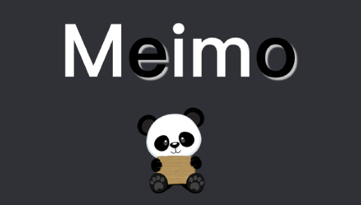

Designed using my own RESTful API Meimo. Here you will find the link to the project and its documentation.

- [Meimo ApiREST](https://github.com/Yulypso/MeimoHerokuJsApiREST)

---

## Features

The project includes the use of several technical features and methods. So here is a list of what was used while coding the application.
- [React-Native Setting up](https://reactnative.dev/docs/environment-setup)
- [React-Native components](https://reactnative.dev/docs/components-and-apis)
- [React Navigation](https://reactnavigation.org/docs/getting-started)

---

## Implementations

several features have been implemented within this application. 

Screens <\br>
- Login Screen
- Register Screen
- Home Screen
- NewMeimo Screen
- Detail Screen <\br>

Components <\br>
- loader
- Meimo item
- Search bar
- Picture item

Others <\br>
- Navigator
- Meimo List

---

## How the mobile app works ? 

### Login Screen

> When launching the application, the login screen is displayed.
> You can connect and access to your meimos.
> If you have no account, you navigate to the register screen.

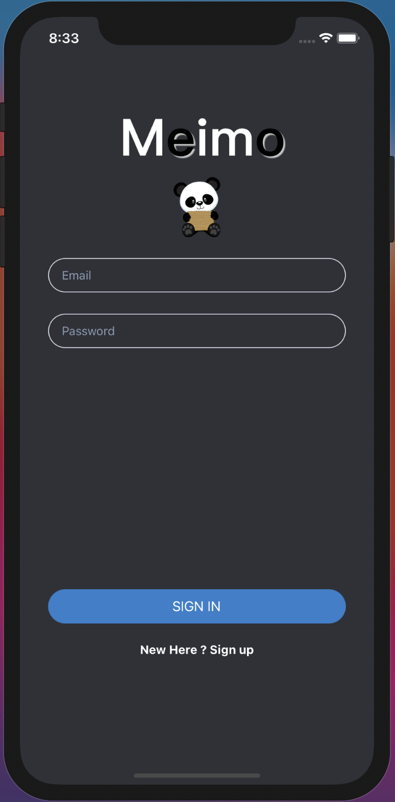

### Register Screen

> Here is the register screen, let's create our account. 

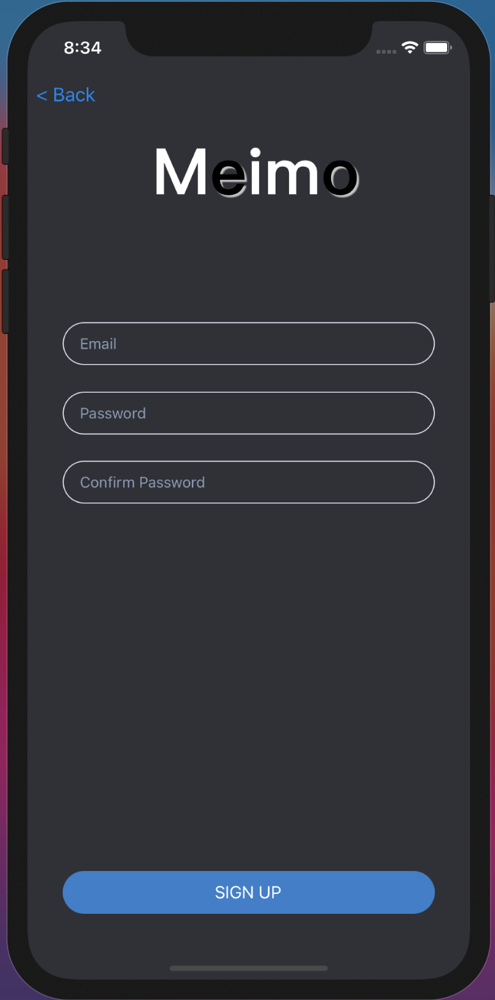
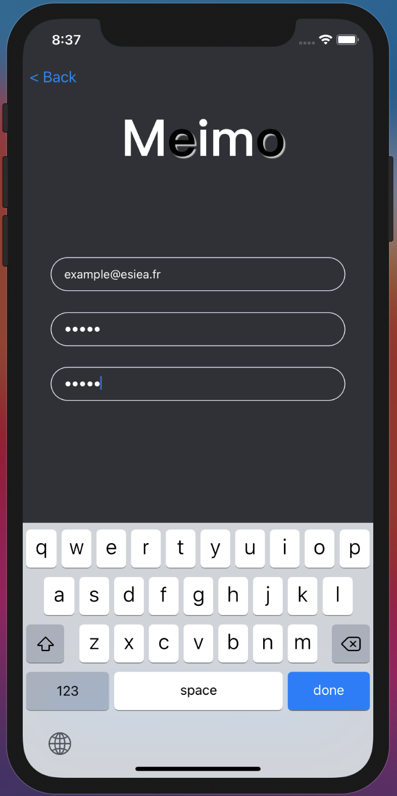

### Home Screen

> Our account has been created, this is the Home screen, where our Meimo's list will be displayed.

    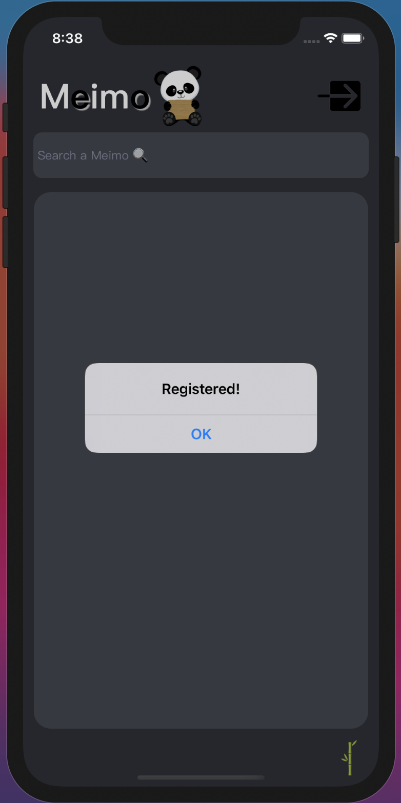

---

### New Meimo Screen

> Let's create our first Meimo!
> And some others ...

    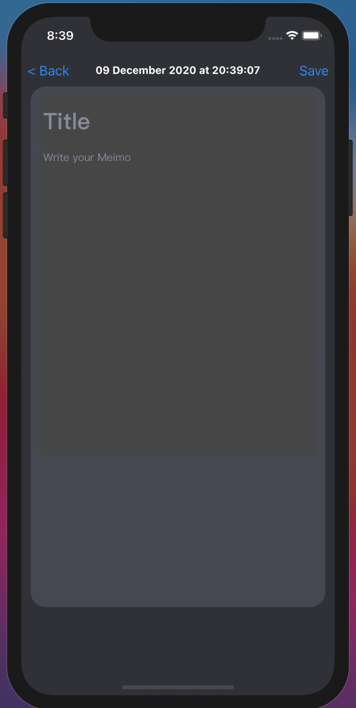
    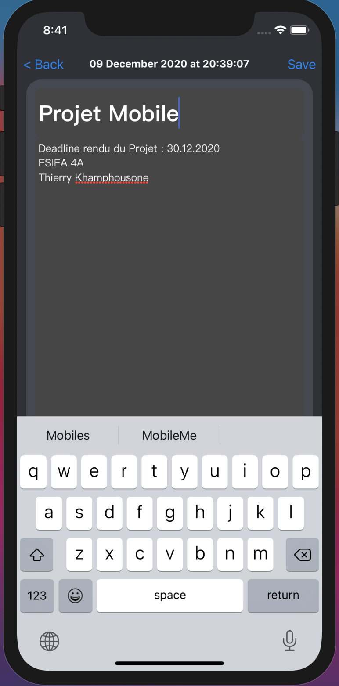
    

### Search bar feature

> An amazing feature was set up for you to search your meimo among several of them!

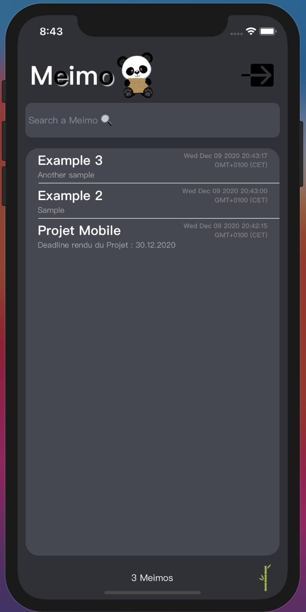
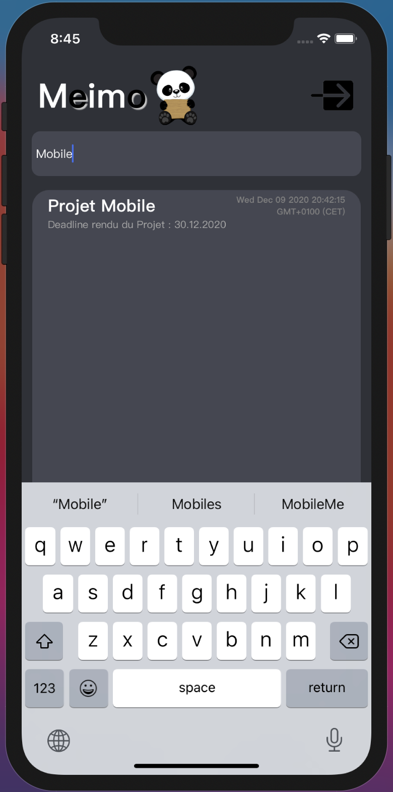

### Details Screen

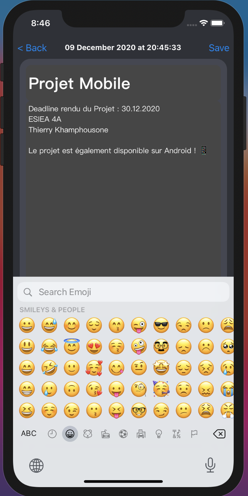
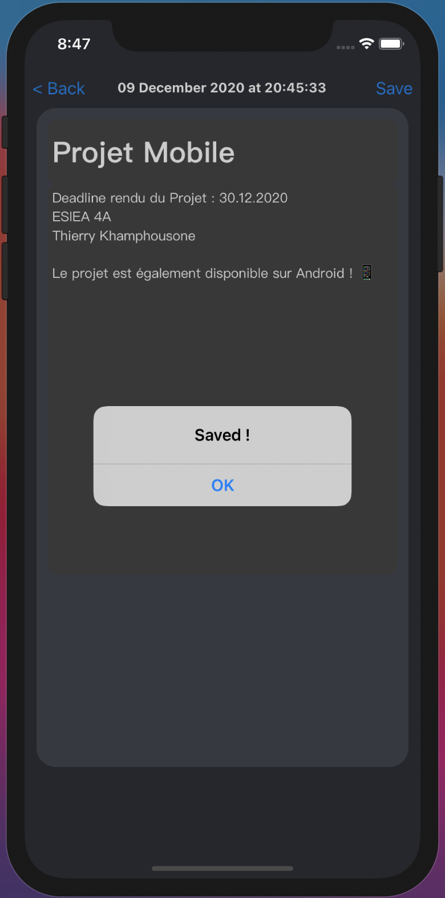

> the last added/edited Meimo goes to the top of the list.

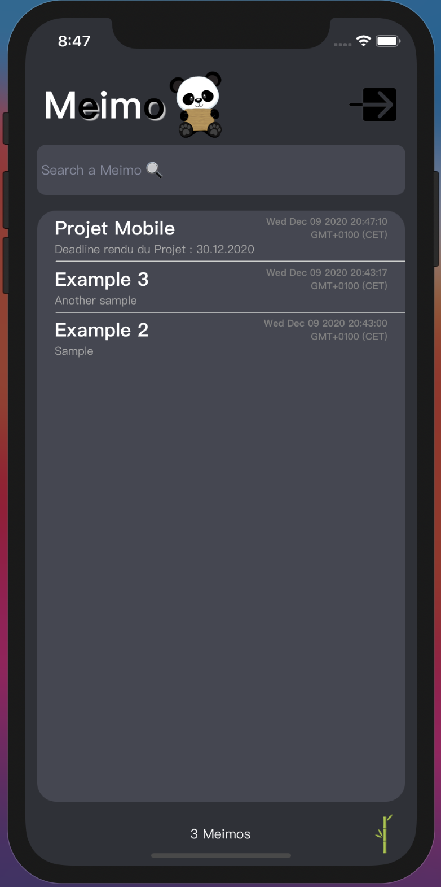

### Disconnect from the App

> You can sign out from the App.

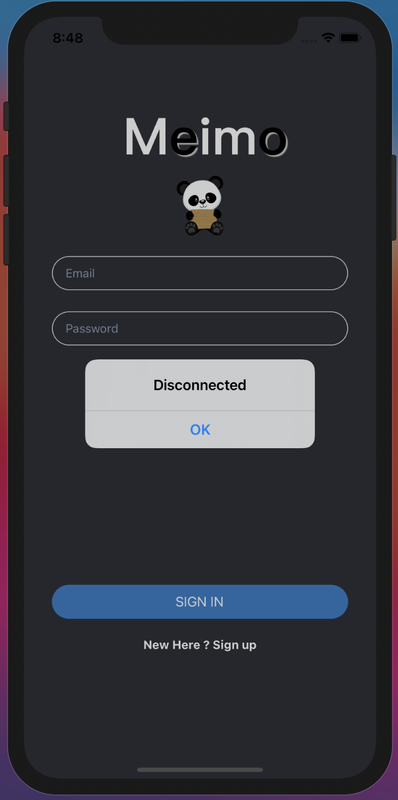

### Login Screen

> You can now reconnect to your personal meimo space.
> It automatically fetch back all your saved meimos!

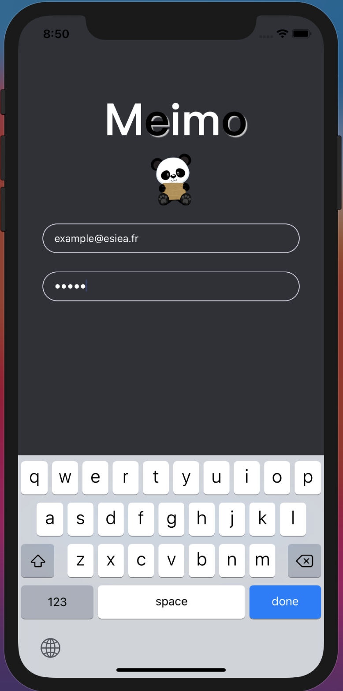

### Feature not implemented

> I thought about adding a feature that would allow users to add their photos to their meimo before saving it. 
> Here is the concept which is functional only locally. Photos are not saved.

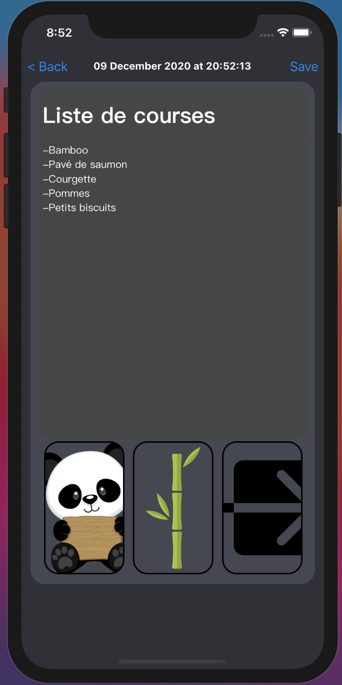

---

### Improvements

In order to improve the mobile application we can:
 - save pictures on a specific cloud and save its url into the database MongoDB
 - Improve the secury of the App 
 - Improve the architecture of the [RESTful API Meimo](https://github.com/Yulypso/MeimoHerokuJsApiREST)

